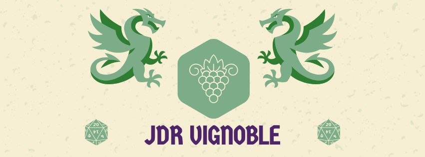

# JDR Vignoble : Une nouvelle communauté pour renouer avec le JDR

Voilà quelques semaines (mois) que je renoue avec le JdR.
Avec l'un de mes gnomes, je démarre une "campagne", ou plutôt une succession d'aventures de pirates.
En cherchant à proposer un format orienté "Jeu de rôle", je me retrouve acculé par l'impatience et l'inventivité enfantine,
dépassé par le déséquilibre entre le temps de préparation et temps de jeu et amené à adapter continuellement des règles 
pour proposer une expérience de jeu fluide et satisfaisante.

Mais je me retrouve à vouloir échanger sur tout ça, pour faire évoluer mes pratiques,
trouver des trucs et astuces pour mener mes parties, et échanger des supports de jeu.
Pour cela, une communauté de rôlistes, serait parfaite !
<!-- more -->

Cependant, la communauté historique à laquelle j'appartiens, la communauté du De-Dale, 
n'est plus active depuis un bon moment. 
Plus d'échange sur les mécanismes de jeu ou la construction des rencontres.
Plus de narration sur les sessions qui se déroulent.
Plus de création narrative, ou d'évasion dans nos univers personnels.
Bref ; je ne trouve pas le terreau nécessaire à cultiver mes reflexion sur le jeu de rôle.

Aussi, je me suis mis en quête d'une nouvelle communauté. 

## Découverte d'une nouvelle communauté : JDR Vignoble

En passant à la boutique du "Temple du Jeu" et en discutant JdR avec le vendeur, celui-ci m'a mis en évidence une affichette
présentant une communauté de rôlistes : un groupe FaceBook "JDR Vignoble".

Ça faisait presque 7 ans que je n'avais pas mis les pieds sur cette plateforme, mais avoir tergiversé,
j'ai pris sur moi pour y retourner et j'ai finalement postulé. 
JdR oblige.
Le groupe existe également sur Discord, et je l'ai rejoint là-bas également.

Pour le moment, je suis hyper enthousiaste, donc peut-être très en demande d'interaction avec la communauté, mais le groupe semble peu actif.
Il y a l'air d'avoir des tables qui se réunissent régulièrement, mais il y a peu d'échange sur les plateformes.
D'un autre côté, ce sont les vacances scolaires ; on a probablement du monde qui est parti en vacances.

Je vais commencer par observer et voir comment vit cette communauté, en posant mes questions naives petit à petit.

## Mes idées

Rejoindre une communauté de rôlistes, m'anime et alime mes envies de créer des choses.
J'ai quelques idées qui me passent par la tête. Je ne sais pas si cela pourrait intéresser des personnes,
en tout cas, je vais déjà les lister ici.

### CV de rôliste

Avant de rejoindre le "JDR Vignoble", je me suis posé la question : Comment je décris mon expérience de rôliste ?
Ça m'a amusé de réfléchir à un "CV de rôliste", où je listerais :

 - les parties (aventures, campagnes run ou one-shot) auxquelles j'ai participé
 - les personnages que j'ai joué, avec leur histoire, leur niveau, leur build
 - les systèmes de jeu
 - les parties que j'ai masterisées (aucune idée si ce terme est universel ou s'il s'agit d'un terme propre à la communauté du De-dale)

Après, il y a pas mal de parties que j'ai oublié, ou pour lequellles je n'ai plus trop de détails.
Peut-être qu'en le faisant avec un Naveed ou une autre personne, il y a des choses qui reviendraient.

D'ailleurs, même si j'ai pas mal masterisé, je l'ai fait avec presque toujours les mêmes personnes.
Ou, tout du moins, un groupe homogène de copains et copines du lycée, avec, de proche en proche, leurs connaissances respectives.*

Je ne sais pas du tout comment faire MJ face à un groupe de parfaits et parfaites inconnues.

### Articles de blog

Des idées d'articles, j'en ai à la pelle.
Prendre le temps de les écrire, c'est nune autre paire de manche.

Je peux au moins lister les idées, et alimenter au fur et à mesure les sujets que je couvre avec.

#### Narration : Les pirates de Sombremer

Narration de la partie pour enfant que je déroule avec ma progéniture.

#### Comment construire une aventure de jeu de rôle ?

Entre toutes les aventures que j'ai construites par le passé
et l'aventure pour enfant que je construis pour les miens, 
c'est peut-être le moment de coucher toutes mes reflexion sur papier.

D'ailleurs, les Pirates de Sombremer peuvent me servir d'exemple pour illustrer les étapes de la construction d'une aventure,
telle que le la conçoit.

#### Les enfants et le jeu de rôle

En cherchant à initier mes enfants au jeu de rôle, je me suis pris des murs.
J'ai fait face à des difficultés auxquelles je n'étais pas préparé.
Je n'ai peut-être pas de solution, mais discuter des murs est parfois intéressant.

### De-Dale : reconstruction archéologique

Le Dé-dale. Des copains. Un forum. Un slack. Une communauté moribonde de près de 20 ans.

Dans mes affaires, j'ai quelque part, gardé des traces de choses qu'on a écrites, des univers que l'on a créé, des parties que l'on a joué.
J'ai un mélange de données de conversation de slack, des emails, des Google Docs, des Documents Words.

L'ambition de l'archéologie : rendre ça disponible et à peu près propre.

### One-shots

En rejoignant une communauté, j'aspire à pouvoir rejouter (un peu).
Je ne me vois pas commencer une campagne avec des inconnu-e-s, mais plutôt initier différents one-shots.
Que ce soit des anciennes aventures Pathfinder, du Shadowrun réchauffé ou des découvertes, 
je pense pouvoir proposer du contenu et animer des sessions qui feront au moins un heureux (moi).

### Tables rondes et autres événements

L'expérience des tables rondes des MJs, avec la communauté du Dé-Dale, était très chouette.
J'aimerais bien reconduire l'experience. LIdée était de se retrouver autour de questions de fond sur le jeu de rôle,
et d'échanger pour voir comment chacun et chacune y répondait.

Quelques exemples de questions :

- Comment rythmer vos pahses de jeu ?
- La gestion de l'urgence : comment la faire vivre ?
- Comment garder une vraie trace de l'aventure ?

D'ailleurs, avec Sharah, on avait dans l'idée de faire une mini-convention sur un week-end à 4-10 personnes.
Peut-être que cette idée pourrait ressortir de derrière les fagots.

## Fin

Bien. Je crois que je me suis assez étalé comme ça et qu'il est temps de conclure pour aujourd'hui.
Objectif : revenir régulièrement pourrir la vie de mes lecteurs imaginaires !
