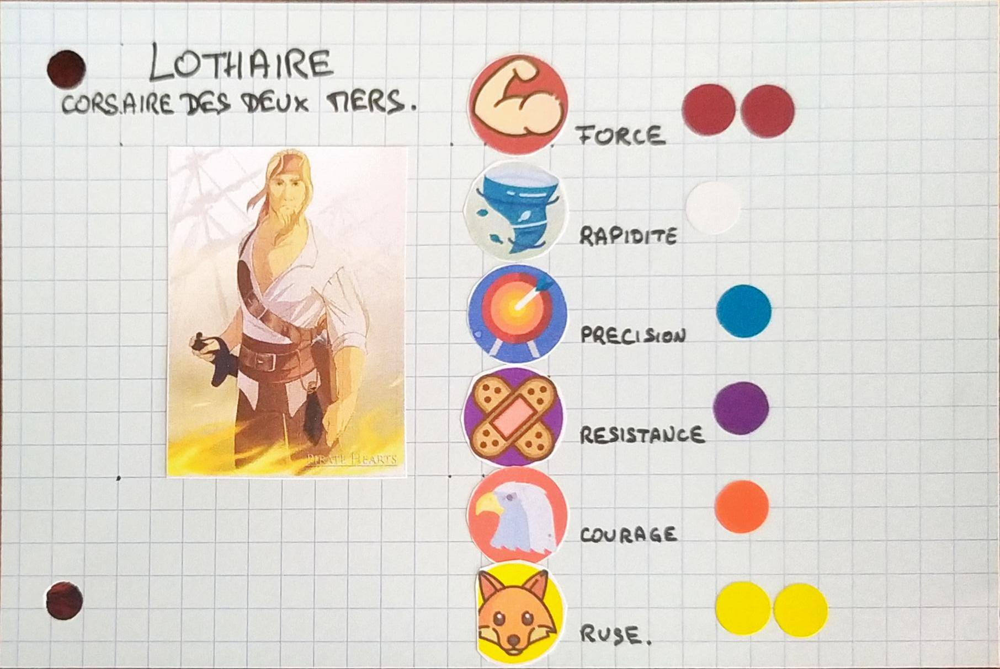

# Jouer aux Jeux de Rôle avec des enfants

Depuis que numéro \#1 est né, j'ai cessé de me rendre régulièrement à une table de jeu. 
Le jeu de rôle et la parentalité sont tous deux tellement chronophage, que j'ai mis le premier en pause.

Néanmoins, je ne désespère pas de pouvoir jouer un jour au jeu de rôle avec mes enfants.
J'ai déjà fait plusieurs tentatives, mais pour le moment le jeu n'a pas vraiment pris, ni de leur côté, ni du mien.

Dans cet article, je présente le parcours ludique que j'ai initié avec mon aîné depuis ses 3 ans, et qui a eu ses 6 ans depuis.
<!-- more -->

## Complexité et frustration

Jouer aux jeux de rôle peut paraître simple : on se met autour d'une table avec une intrigue à résoudre
et on fait fonctionner notre imagination pour créer une narration partagée.

Mais pour un enfant, ce n'est pas si facile que ça.
L'imagination est débordante et il faut pouvoir la canaliser.
Il faut être en mesure de respecter la "règle du oui", de s'écouter et de construire le récit ensemble.

De plus, il faut pouvoir comprendre que le succès ou l'échec d'une action est conditionné par un lancer de dé.

Et pour l'adulte (en l'occurrence, moi), il faut être en mesure de comprendre plusieurs choses également.
Le scénario doit rester très simple, pour ne pas perdre l'enfant.
La session ne peut pas durer trop longtemps, car se concentrer trop longtemps pour un enfant est parfois difficile.

Enfin, il faut accepter de pouvoir jouer en 20 minutes, un scénario qui aura demandé 2h de préparation.

## Aborder progressivement les différents aspects du jeu

Différents jeux de rôle proposent des règles et des univers différents : Donjons & Dragons, ShadowRun, et Cthulhu pour ne citer que ces trois là, sont vraiement très différents.
Les règles sont plus ou moins complexes, et les séquences de jeu plus ou moins compliqué.
Pour jouer avec des enfants, il faut conserver les règles les plus simples possibles.

Néanmoins, tous les deux de rôle partagent quelques concepts clés.
Pour pouvoir jouer pleinement à un jeu de rôle, il faut pouvoir bien saisir les concepts du jeu de rôle.

### Les trois composantes majeures

Dans un jeu de rôle, les joueurs se choisissent un personnage, qui sera leur avatar dans le jeu et leur permettra d'interagir avec l'univers.
Les actions du personnage feront avancer la narration et l'histoire partagée.

Cette mécanique de "personnage" et la modélisation de ses actions, sont parfaitement utilisées dans les "Livre-Jeu",
également appelés "Livre dont vous êtes le héros".
On y retrouve également les trois composantes majeures du jeu de rôle : (le_courage, la chance et la destinée)[https://fr.wikipedia.org/wiki/Livre-jeu#Le_courage,_la_chance_et_la_destin%C3%A9e]

#### Le courage

Le courage est l'essence même du jeu de rôle.
Il s'agit des décisions prises par le joueur pour surmonter les obstacles que la narration lui impose.

#### La chance

La chance est une part importante dans le jeu de rôle et prend deux aspects différents.

La chance lors de la prise de décision : les joueurs ne connaissent pas les informations de la narration.
Ils prennent des décisions en s'appuyant sur informations incomplètes, en espérant que l'issue leur sera favorable.
La découverte du scénario fait partie intégrante du jeu.

La chance lors de la résolution des actions : lorsque le personnage-joueur entreprend une action, dans la plupart des jeux, 
celle-ci n'est pas garantie de succès.
L'issue de l'action est conditionnée par un système de hasard (souvent un lancer de dés), et l'enjeu des décisions
est de choisir le ratio gain-risque que le joueur est prêt à prendre pour faire avancer l'histoire de son personnage.

#### La destinée

Le plus souvent, la Meneuse ou le Meneur de Jeu (ou Narrateurice) reste maître sur le déroulé du scénario.
Cette personne a le maître mot sur le déroulé de l'histoire et sur les scènes à mettre en place.
Les personnages des autres joueurs n'agissent que dans le décor du scénario : ils sont donc soumis à la destinée

### Les trois piliers de l'aventure

Dans le jeu de rôle, les joueurs décident des actions de leurs personnages. 
Pour simplifier le jeu, on modélise ces actions en les faisant correspondre à des phases de jeu distinctes, 
souvent au nombre de trois : l'exploration, les interactions sociales et le combat. 

#### L'exploration

Il s'agit de la phase de jeu la plus générique.
Les personnages interagissent librement avec leur environnement, souvent avec peu de conséquence.
Par exemple :

- La vie quotidienne
- Les voyages
- la collecte d'information

On y retrouve tout de même des actions avec davantage d'enjeu comme :

- Les phases d'infiltration
- La recherche / désamorçage de pièges

#### Les interactions sociales

Cette phase est généralement la moins documentée dans les règles de jeu de rôle.
Il s'agit du moment où un ou plusieurs personnages, discutent avec une entité de l'univers de jeu.

On parle parfois de "Rôle play", car les joueureuses acceptent plus facilement de théâtraliser leur personnage dans cette phase car le personnage "prend vie".
N'oublions pas que le "rôle" est également endossé dans les autres phases, même si on ne joue pas à un jeu d'acteur avec son personnage.

#### Le combat

La phase où les personnages mettent tout en œuvre pour battre un adversaire, que ce soit pour le tuer,
le capturer ou le faire fuir.

La plupart des jeux de rôle auxquels j'ai joué, possède un corpus de règles très détaillées sur cette phase.
Les choix sont souvent tactiques, les actions extrêmement rationnées, et le respect des règles (et de l'équilibre du jeu) favorisé au détriment de la narration.

Par ses très nombreuses règles, c'est une phase dans laquelle il est facile de se réfugier, 
car il est moins fatiguant de se raccrocher à des règles écrites, qu'à une narration parfois éprouvante.

### Comment découper

Les concepts du jeu de rôle se retrouvent dans d'autres jeux et d'autres activités.
Voici une liste non exhaustive de choses que j'ai testé en espérant initier mes enfants à un concept ou à un autre.

// TODO

Plusieurs jeux pour découper les différents aspects

#### Ma première aventure - Game Flow

> [🔗 Ma première aventure](https://ma-premiere-aventure.fr/) 
> 🎂 3+ ans

Ma première aventure est une collection de livres-jeux pour les enfants à partir de 3 ans, des éditions [GameFlow](http://www.game-flow.fr/Jeux).
Dans ces livres, vous commencez par choisir un personnage parmi trois et vous partez à l'aventure, qui se découpe en différentes scènes, le plus souvent six.
À chaque scène, vous avez trois choix possibles pour faire avancer la narration comme bon vous semblera.
Les pages sont découpées en trois parties égales ; le haut, le milieu et le bas et chaque partie correspond à un choix possible.
Si vous faites les "bons" choix sur les trois premières scènes, vous pourrez alimenter votre inventaire avec des objets
permettant d'avancer en sécurité dans les trois dernières scenes 

Je trouve ces livres vraiment très ludiques.
Matérialiser chaque choix par une section de la page du livre permet à l'enfant de visualiser les conséquances de son choix, tout en conservant une lecture fluide de l'histoire.
Cela permet de bien explorer le concept de "**courage**" dans le jeu de rôle.

Comme tout livre jeu, la "**chance**" et la "**destinée**" sont rès présentes également, bien que nous relisons ces livres souvent.
La "chance" tend à s'amenuiser, car on commence à bien connaître les histoires, et nous sommes en mesure de choisir les arcs narratifs qui nous plaisent (ou qui donnent des objets)

#### Petits détectives de monstres - La loutre roliste

> [🔗 Petits détectives de monstres](https://www.laloutreroliste.com/store/14-petits-detectives-de-monstres) 
> 🎂 3+ ans

Un copain m'avait conseillé le jeu de rôle "Petits détectives de monstres" pour commencer à jouer avec les enfants.
J'ai suivi son conseil et testé le jeu.

**exploration**

#### Les Pirates de Sombremer - Moi

> 🔗 Lien à venir 
> 🎂 3+ ans

Fort de mon expérience avec les "Petits détectives de monstres", j'ai cherché à utiliser des mécaniques que je 
connaissais et qui me paraissaient davantage accessibles.

Dans les jeux que l'on manipule habituellement, il y a toujours un dé cubique à 6 faces, qui me paraît l'élément le plus 
simple pour introduire le hasard auprès des enfants.
Pour modéliser le succès ou l'échec, le plus simple est de reprendre la mécanique de ShadowRun.
C'est-à-dire, d'introduire le concept de "réussite" sur :material-dice-5-outline::material-dice-6-outline:
et pas de "réussite" sur :material-dice-1-outline::material-dice-2-outline::material-dice-3-outline::material-dice-4-outline:.

De plus, à 6 ans, mon aîné entre en CP : je pense que lui infliger les additions des d6 serait rébarbatif.
C'est également l'une des raisons qui me poussent à évincer le d20.

Pour la feuille de personnage, je prends une fiche Bristol de 10x15cm que je sépare en deux.
- La partie de gauche ve servir à dessiner, coller, écrire ce que l'enfant souhaite pour faire son personnage.
- La partie de droite va servir pour "écrire" les caractéristiques du personnage.

Chaque caractéristique est représentée par une image, son nom et des petites gommettes (ronds de 10mm) représentant
le nombre de dés à lancer lorsque c'est nécessaire.
J'ai utilisé les caractéristiques suivantes : 

- {width=24px} Force
- {width=24px} Rapidité
- {width=24px} Précision
- {width=24px} Résistance
- {width=24px} Courage
- {width=24px} Ruse

Le rendu final donne quelque chose comme ça :

<figure markdown>
  {width=300px}
  <figcaption>Lothaire, Corsaire des deux mers</figcaption>
</figure>

Quant aux scénarios, et bien, il faut faire travailler son imagination.

... Et accepter de jouer en 20 minutes, un scénario qui a demandé plus de 2h de préparation.

#### Les chroniques d'Avel - Rebel

- **Avel**, une révélation pour le mécanisme de combat (https://www.philibertnet.com/fr/rebel/111641-chronicles-of-avel-5902650616394.html)

#### Jeu de rôle Junior - Fleurus

- La gamme "Jeu de rôle Junior"

#### D'autres inspirations

Un autre jeu inspirant :
https://gusandco.net/2020/03/18/donjons-chenapans-jeu-enfants/

## Conclusion

Je n'ai pas encore joué avec l'aspect de l'**interaction sociale** dans le jeu de rôle.

Je me réfugie derrière :
À 6ans, la théorie de l'esprit pas encore complètement acquise et c'est déjà compliqué pour les enfants de comprendre qu'on ne sait pas les mêmes choses qu'eux.
Si on ajoute la couche d'abstraction que constitue le personnage et la couche de complexité supplémentaire pour comprendre
ce qu'est un personnage non-joueur, je ne pense pas être prêt à introduire les interactions sociales dans le jeu de rôle.
